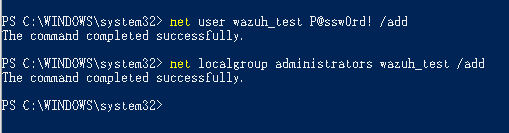
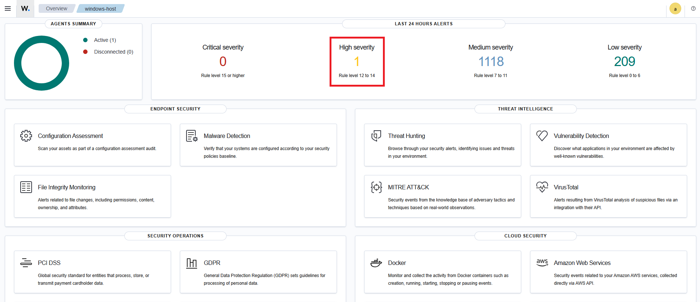
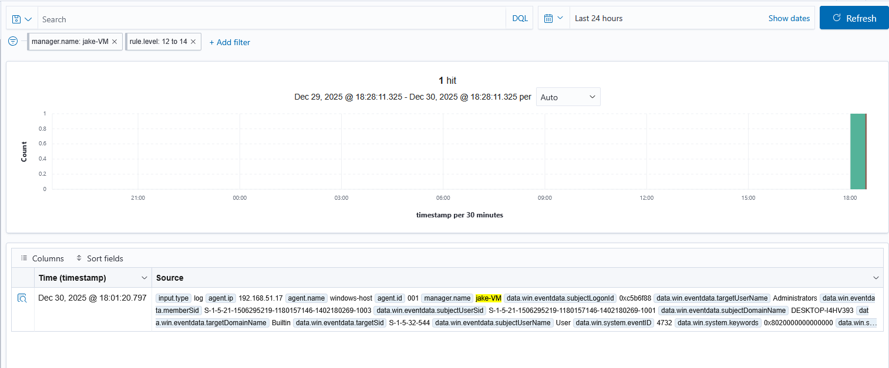
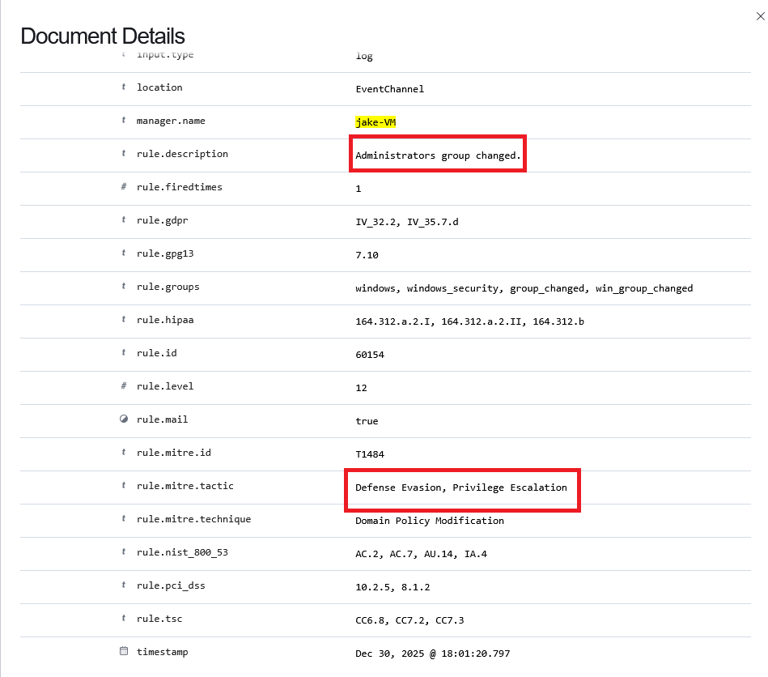

# Mini SIEM Lab w/ Wazuh on Ubuntu 22.04

This project demonstrates a Mini SIEM (Security Information and Event Management) lab built using Wazuh on an Ubuntu virtual machine to monitor a Windows 10 host. The lab focuses on log collection, detection, and basic threat analysis using Windows Security logs and Sysmon telemetry.


## Tech
- Wazuh (Manager, Agent, Dashboard)
- Ubuntu Linux (SIEM Server)
- Windows 10 Pro (Endpoint)
- Sysmon (SwiftOnSecurity configuration)
- PowerShell
- MITRE ATT&CK mapping (via Wazuh rules)


## Installation

Wazuh Server on Ubuntu (VM) :
```
curl -sO https://packages.wazuh.com/4.8/wazuh-install.sh
sudo bash wazuh-install.sh -a
```

Wazuh Agent on Windows (Host) :
```https://packages.wazuh.com/4.x/windows/wazuh-agent-4.8.2-1.msi```

Sysmon Download :
```https://learn.microsoft.com/en-us/sysinternals/downloads/sysmon```

Sysmon-Config (SwiftOnSecurity) :
```https://github.com/SwiftOnSecurity/sysmon-config```

# Example
Create new user and grant an administrator to it:









## License

MIT

